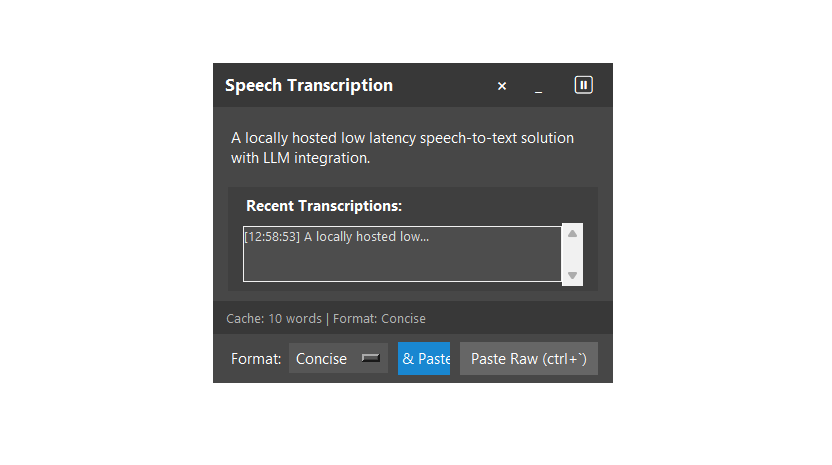

# Speak Now

A locally-hosted, low-latency speech-to-text solution with AI formatting capabilities.

## Overview

Speak Now captures your speech in real-time, transcribes it, and allows you to paste it directly into any application with minimal latency. What sets it apart is the seamless integration with Google's Gemini AI to intelligently format your dictated text before pasting, all while maintaining a workflow that doesn't interrupt your focus.


## Features

<div align="center">
  
  <p><em>Minimum (and completely hidden-able) UI</em></p>
</div>

- **Real-time Speech Recognition**: Captures your speech continuously with low latency
- **AI-Powered Formatting**: Uses Gemini 1.5 Flash to transform raw transcription into polished text
- **Multiple Formatting Styles**: Choose between Natural, Formal, Concise, or custom formatting styles
- **Hotkey Controls**: Use keyboard shortcuts to control all aspects of the application
- **Hide-able UI**: Interface can be completely hidden to avoid workflow disruption
- **History Tracking**: Access your recent transcriptions for easy reuse
- **Recording Toggle**: Pause and resume speech recognition as needed
- **Customizable Configuration**: Adjust settings via a TOML configuration file


## Setup

Install Speak Now via pip:

```bash
pip install speak-now
```

For optimal performance with GPU acceleration, see the [RealtimeSTT](https://github.com/KoljaB/RealtimeSTT) documentation.

Launch the application with:

```bash
speak-now -c <config>
```

The application will use default settings if no configuration file is specified.

To start in hidden mode (UI remains hidden until manually toggled):

```bash
speak-now -c <config> --hidden
```

Alternatively, set `start_hidden = true` in your configuration file.


## Hotkeys

| Action | Default Hotkey | Description |
|--------|---------------|-------------|
| Paste Raw | Ctrl+` | Paste unformatted transcription text |
| Format & Paste | Alt+` | Format transcription with Gemini and paste |
| Toggle Recording | Ctrl+Alt+Space | Start/pause speech recognition |
| Toggle Window | Ctrl+Alt+V | Show/hide the application window |

## Formatting Options

- **Natural**: Improves flow and fixes grammar while maintaining your voice
- **Formal**: Transforms text into professional, business-appropriate language
- **Concise**: Condenses text while preserving important information
- **Catgirl**: Fun transformation to sound like a cute catgirl (example of custom style)
- **None**: No formatting, equivalent to "Paste Raw"

## Configuration

Speak Now uses a TOML configuration file (`stt_config.toml`). Key settings include:

```toml
[api]
gemini_api_key = ""  # Set your Gemini API key or use environment variable
model = "gemini-1.5-flash"  # Choose Gemini model to use

[stt]
model = "large-v2"  # Speech recognition model
timeout = 1.0  # Recognition timeout

[hotkeys]
paste_raw = "ctrl+`"
paste_formatted = "alt+`"
toggle_recording = "ctrl+alt+space"
toggle_window = "ctrl+alt+v"

[ui]
opacity = 0.90
max_history_items = 10
default_format = "Concise"
start_hidden = false  # Set to true to start with the UI hidden

[formatting_prompts]
# Customize these prompts to change formatting behavior
Natural = "Reformat this transcription to sound more natural and fix any grammar issues: "
Formal = "Reformat this transcription into formal, professional language: "
Concise = "Reformat this transcription to be more concise while preserving all important information: "
Catgirl = "Reformat this transcription to sound like a cute catgirl talking: "
None = ""  # No formatting
```

## Current Status

This project is a work in progress. While the core functionality works well, you may encounter occasional bugs or limitations as development continues. The focus is on maintaining low latency and seamless integration with your existing workflow.

## Key Benefits

- **Minimal Disruption**: Can operate completely in the background
- **Low Latency**: Designed for real-time use with minimal delay
- **Integration**: Works with any application that accepts text input
- **Customizable Experience**: Tailor the tool to your specific needs
- **Privacy-Focused**: Speech recognition runs locally


## Building from Source

To build wheels manually, run the following commands:
```bash
python -m pip install build twine
python -m build
twine check dist/*
twine upload dist/*
```

## License

The project uses MIT License. See [LICENSE](LICENSE) for details.