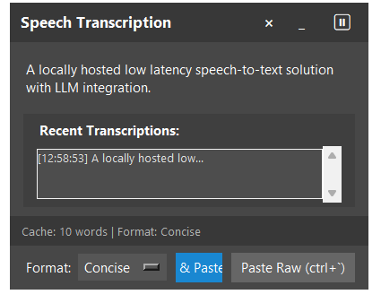

# Speak Now

A locally-hosted, low-latency speech-to-text solution with LLM integration.

## Overview

Speak Now captures your speech in real-time and allows you to paste it as text with optional LLM-based formatting. It's designed to be lightweight and efficient for everyday use.

## Features

- **Real-time transcription** using local speech recognition
- **Keyboard shortcuts** for quick actions:
  - Toggle recording: `Ctrl+Alt+Space`
  - Paste raw text: `Ctrl+`
  - Format and paste: `Alt+`
- **Text formatting** via Google's Gemini API
- **Format options** include:
  - Natural - smooths out transcription 
  - Formal - professional language
  - Concise - preserves key information while reducing length
  - Catgirl - adds a playful style (example custom format)
  - None - no formatting
- **Simple GUI** for monitoring status and selecting format options

## Setup

1. Clone this repository
2. Install dependencies: `pip install -e .`
3. Set up your Gemini API key in `stt_config.toml` or as environment variable
4. Run the application: `python stt_cache_v2.py`

## Configuration

A default config file will be generated on first run. You can customize:
- API settings (Gemini key, model)
- Speech-to-text model and options
- Keyboard shortcuts
- UI settings
- Formatting prompts

## Current Status

This project is a work in progress. Basic functionality is implemented but you may encounter bugs or limitations. Contributions and feedback are welcome!

## License

MIT License